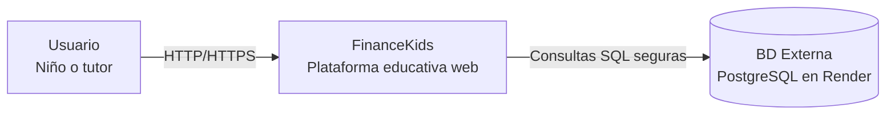
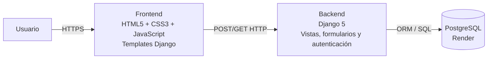

# Arquitectura de FinanceKids

FinanceKids se implementa como una aplicación web monolítica con Django, frontend server-rendered y persistencia en PostgreSQL desplegada en Render. La comunicación entre usuario y aplicación se realiza por HTTP/HTTPS, y el backend se conecta a la base de datos mediante el driver configurado por Django.

## C4 - Nivel 1: Contexto

### Tecnologías del contexto
- Cliente: Navegador web moderno
- Sistema principal: Django con templates server-rendered
- Base de datos externa: PostgreSQL administrada en Render
- Transporte: HTTP/HTTPS

## C4 - Nivel 2: Contenedores

### Contenedores y responsabilidades

#### Frontend
- Renderiza vistas como `login`, `registro` e `index`
- Usa HTML5 semántico, CSS3 con Flexbox/Grid y JavaScript para validación en cliente
- Consume endpoints HTTP del backend servidos por Django

#### Backend
- Gestiona autenticación, registro, progreso del usuario y acceso a contenidos
- Implementa validaciones de servidor con Django Forms
- Expone vistas HTML y endpoints ligeros para validaciones dinámicas

#### Base de datos
- Almacena usuarios, perfiles y progreso de temas
- Se accede desde Django mediante ORM y conexión configurada por variables de entorno

## Decisión arquitectónica actual
- **Estilo:** monolito web Django
- **Ventaja:** simplicidad para el proyecto integrador, con frontend, lógica y persistencia en una sola base de código
- **Escalabilidad inicial:** suficiente para una primera entrega académica, manteniendo separación clara entre frontend, backend y base de datos
